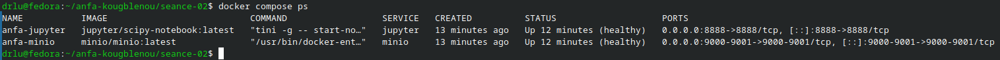
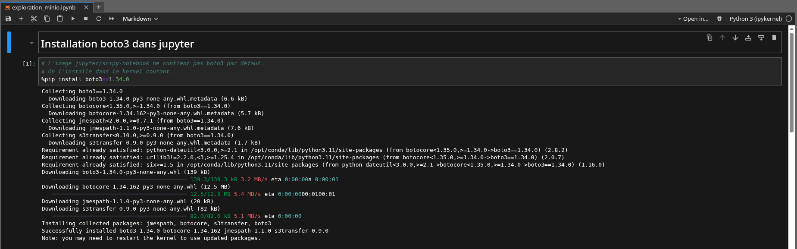
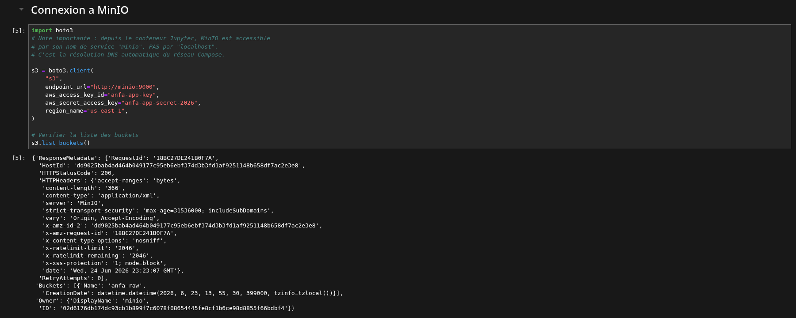
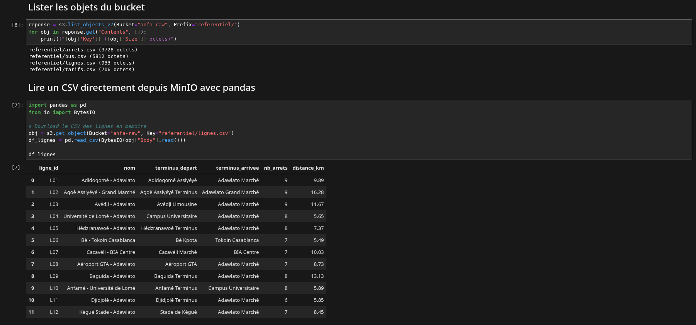
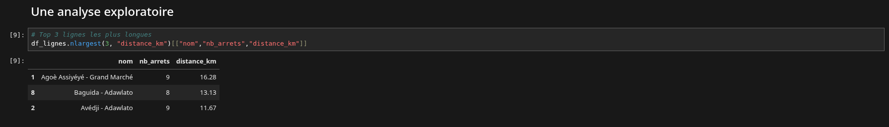
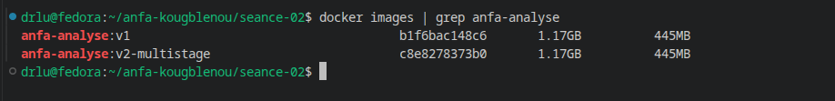

# Rendu - séance 2

**Nom et prénom :** Amos Kokou KOUGBLENOU
**Identifiant GitHub :** akinnoamakawg
**Date de soumission :** 25/06/2026

## Resumé de la séance

## Capture d'écran

### Docker compose ps

### Notebook Jupyter

## Bonus multi-stage (Optionnel)

## Difficultés rencontrées

## Exercices d'application

**Exercice 1:**

1.1 C
Un conteneur partage le noyau de la machine hôte.
Justification : contrairement à une VM (qui embarque son propre noyau via un hyperviseur), un conteneur Docker réutilise le noyau du système hôte, ce qui le rend beaucoup plus léger et rapide à démarrer.

1.2 B
L'image est un modèle figé en lecture seule ; le conteneur est une instance en cours d'exécution.
Justification : une image est un patron immuable construit par couches successives, tandis qu'un conteneur est une instance vivante (avec son propre filesystem en écriture et ses processus) créée à partir de cette image.

1.3 B
les namespaces (PID, NET, MNT, UTS, IPC, USER) isolent la vue qu'un processus a du système — processus, réseau, points de montage, hostname, etc.

1.4 A
les control groups (cgroups) permettent de limiter et de comptabiliser l'usage CPU, mémoire, I/O disque, etc. par groupe de processus.

1.5 B
macOS n'a pas de noyau Linux ; Docker Desktop démarre une petite VM Linux (via le framework de virtualisation d'Apple) qui héberge le moteur Docker et exécute réellement les conteneurs.

1.6 B
DotCloud était une plateforme PaaS qui a développé Docker en interne avant de l'open-sourcer en mars 2013.

1.7 C
les namespaces et cgroups existaient déjà et étaient utilisés par LXC ; l'apport réel de Docker est l'écosystème autour (Dockerfile, images en couches, Docker Hub, CLI ergonomique).

1.8 B
l'OCI standardise les formats d'image (image-spec) et de runtime (runtime-spec) afin d'assurer l'interopérabilité entre outils (Docker, containerd, CRI-O…).

**Exercice 2:**

2.1 
FROM python:3.11  : définit l'image de base — ici une image officielle Python 3.11 (basée sur Debian), complète et relativement lourde.

WORKDIR /application : crée (si nécessaire) et définit

COPY . /application  : comme répertoire de travail pour toutes les instructions suivantes.

RUN pip install -r requirements.txt : exécute pip install pendant le build pour installer les dépendances Python listées dans le fichier.

EXPOSE 5000 : documente que l'application à l'intérieur du conteneur écoute sur le port 5000 (purement informatif).

CMD ["python", "main.py"] : définit la commande exécutée par défaut au démarrage du conteneur.

2.2 
**EXPOSE 5000** est purement déclaratif : il informe les développeurs (et certains outils, comme docker run -P) du port utilisé par l'application, mais ne crée aucun mappage réseau réel vers l'hôte.

**-p 5000:5000** de **docker run** effectue le mappage effectif : il publie le port 5000 du conteneur sur le port 5000 de la machine hôte, rendant le service réellement accessible depuis l'extérieur du conteneur.

2.3 
- Mauvais ordre des instructions (cache non optimisé) : COPY . /application est exécuté avant RUN pip install. Or toute modification du code source — même un fichier non lié aux dépendances — invalide le cache Docker à partir de cette couche, ce qui force la réinstallation complète des dépendances à chaque build.
→ Correction : copier d'abord uniquement requirements.txt, installer les dépendances, puis copier le reste du code.

- Exécution en root : aucun utilisateur n'est créé ; le conteneur tourne donc par défaut en root, ce qui constitue un risque de sécurité (en cas de compromission de l'application, l'attaquant dispose des droits root dans le conteneur).
→ Correction : créer un utilisateur non privilégié avec useradd et basculer dessus via USER.

*(On pourrait également citer : l'image python:3.11 complète est inutilement lourde par rapport à une variante slim, et l'absence de .dockerignore risque de copier des fichiers inutiles comme .git, venv/, etc.)*

2.4
# Image légère plutôt que l'image Python complète
FROM python:3.11-slim

WORKDIR /application

# On copie d'abord uniquement requirements.txt pour profiter du cache Docker :
# si seul le code change (pas les dépendances), cette couche n'est pas rejouée.
COPY requirements.txt .
RUN pip install --no-cache-dir -r requirements.txt

# Le reste du code est copié après l'installation des dépendances
COPY . .

# Création d'un utilisateur non-root et changement de propriétaire des fichiers
RUN useradd -m appuser && chown -R appuser:appuser /application
USER appuser

EXPOSE 5000

CMD ["python", "main.py"]

**Exercice 3:**

3.1
FROM python:3.11-slim
WORKDIR /app
RUN pip install -r requirements.txt
COPY . .
CMD ["python", "main.py"]

a. Cause précise de l'erreur
Au moment où RUN pip install -r requirements.txt s'exécute, requirements.txt n'existe pas encore dans l'image : l'instruction COPY . . (qui apporte le code, donc le fichier) n'est exécutée qu'après. À cet instant du build, /app est vide, donc pip ne trouve pas le fichier.

b. Correction Inverser l'ordre — copier (au moins) requirements.txt avant de lancer pip install :

FROM python:3.11-slim
WORKDIR /app
COPY requirements.txt .
RUN pip install -r requirements.txt
COPY . .
CMD ["python", "main.py"]

c. Pourquoi cette erreur illustre une mauvaise compréhension de Docker
Chaque instruction d'un Dockerfile s'exécute séquentiellement, dans l'état du filesystem de l'image tel qu'il existe à cet instant précis du build — il n'y a pas de vision globale ou "future" du contenu final. L'étudiant a probablement raisonné comme si tous les fichiers du projet étaient déjà présents dès le début du build (comme sur sa machine locale), alors qu'en réalité l'image part d'un filesystem minimal (celui de l'image de base) qui ne contient que ce qui a été explicitement copié par les instructions précédentes.

3.2
a. Erreur dans DATABASE_URL
localhost dans l'URL fait référence au conteneur api lui-même, pas au conteneur db. Chaque conteneur a son propre localhost isolé : db n'écoute jamais sur celui d'api. Docker Compose crée un réseau interne avec une résolution DNS automatique entre services — il faut donc utiliser le nom du service comme nom d'hôte.

b. Correction

DATABASE_URL: "postgresql://user:password@db:5432/anfa"

(remplacer localhost par db, le nom du service Postgres défini dans le compose).

**Exercice 4:**

a. Au moins quatre problèmes

    1. Image de base trop lourde : ubuntu:22.04 est une distribution généraliste volumineuse, alors qu'une image Python officielle slim (voire alpine) suffirait largement pour une simple application Python — c'est la principale cause du poids de 1,1 Go.

    2. Paquets inutiles à l'exécution : curl, wget, git, build-essential sont installés alors que le seul besoin réel est requests (paquet Python pur, sans compilation). build-essential en particulier (compilateurs, headers…) est très volumineux et n'apporte rien au runtime.

    3. Cache APT non nettoyé : chaque RUN apt-get ... ajoute une couche et ne supprime pas le cache des listes de paquets (/var/lib/apt/lists/*), ce qui gonfle inutilement la taille finale de l'image.

    4. Mauvais ordre des instructions (cache de build inefficace) : COPY . /app est fait avant pip3 install, donc toute modification du code (même mineure) invalide le cache et force la réinstallation complète des dépendances à chaque build.

    5. Exécution en root (sécurité) : aucun utilisateur n'est créé, le conteneur s'exécute par défaut avec les droits root.

b. Version optimisée (commentée)

# Image officielle Python "slim" : bien plus légère qu'Ubuntu complet,
# suffisante puisqu'on n'a besoin que de Python et de pip.
FROM python:3.11-slim

WORKDIR /app

# On copie uniquement requirements.txt en premier : si le code change mais
# pas les dépendances, cette couche reste en cache et n'est pas rejouée.
COPY requirements.txt .

# --no-cache-dir évite de stocker le cache pip dans l'image (gain de place).
# requests est un paquet pur Python : pas besoin de curl/wget/git/build-essential.
RUN pip install --no-cache-dir -r requirements.txt

# Le code applicatif est copié après l'installation des dépendances
COPY . .

# Création et utilisation d'un utilisateur non-root pour l'exécution (sécurité)
RUN useradd -m appuser
USER appuser

CMD ["python3", "downloader.py"]

Remarque : si des outils système (ex. git) étaient réellement nécessaires au runtime, on les installerait via apt-get install -y --no-install-recommends <pkg> && rm -rf /var/lib/apt/lists/* dans une seule couche RUN, voire mieux, via un build multi-stage qui ne garde que les artefacts strictement nécessaires dans l'image finale.

**Exercice 5:**

a. Services à conteneuriser

**etl :** Script Python qui se connecte au FTP, télécharge et nettoie le JSON Lines de la journée, puis écrit les résultats agrégés dans MinIO — exécution batch nocturne.

**minio :** Service de stockage objet S3-compatible qui héberge les données agrégées — stockage persistant et point d'accès pour Jupyter.

**jupyter :** Conteneur Jupyter (notebook/lab) pour l'exploration des données stockées dans MinIO et la création de graphiques — environnement d'analyse interactive.

(Optionnel : un service scheduler/cron dédié si l'on veut déclencher automatiquement etl chaque nuit indépendamment d'un orchestrateur externe.)

b. Restart policy pour le script FTP

Je recommande on-failure (éventuellement on-failure:3). Ce script est un job batch ponctuel : il doit s'exécuter une fois par nuit puis s'arrêter, et non tourner en continu — always ou unless-stopped le relanceraient en boucle même après un succès, ce qui n'a pas de sens pour un traitement journalier. on-failure permet de retenter automatiquement en cas d'échec transitoire (ex. FTP temporairement indisponible) sans relancer indéfiniment un conteneur déjà terminé avec succès.

c. Passer la date au script (rejouabilité)

Deux mécanismes possibles côté Docker :

    1. Variable d'environnement : passer la date via environment: RUN_DATE=2026-06-20 dans le compose (ou docker run -e RUN_DATE=...). Le script lit os.environ["RUN_DATE"], avec une valeur par défaut = date du jour si absente.

    2. Override de la commande au lancement : docker compose run etl python script.py --date 2026-06-20, qui surcharge le CMD par défaut du conteneur en passant l'argument directement sur la ligne de commande.

**Recommandation :** la variable d'environnement. Elle s'intègre naturellement à l'approche "12-factor app" (configuration externalisée), se prête bien à une automatisation future (scheduler, CI/CD, Airflow) qui injecte simplement une variable, et ne nécessite pas de reconstruire toute la ligne de commande à chaque rejeu.

d. Pourquoi un conteneur séparé plutôt que le script dans Jupyter ?

Mélanger le script ETL et l'environnement Jupyter dans un même conteneur viole le principe « un conteneur, une responsabilité ». Jupyter est un outil interactif destiné à rester disponible en continu, alors que le script est un job batch ponctuel qui doit pouvoir être lancé, arrêté et rejoué indépendamment, avec sa propre restart policy et ses propres logs. Les séparer permet de redémarrer, mettre à jour ou faire évoluer l'un sans impacter l'autre, d'avoir des images plus légères et ciblées (Jupyter n'a pas besoin des dépendances FTP, et inversement), et de faciliter l'orchestration automatique du pipeline (cron/scheduler) sans dépendre de l'état du notebook.

e. Squelette de docker-compose.yml

version: "3.8"

services:
  etl:
    build: ./etl
    environment:
      RUN_DATE: "${RUN_DATE:-}"
      MINIO_ENDPOINT: "minio:9000"
    depends_on:
      - minio
    restart: "on-failure"
    volumes:
      - ./etl/logs:/app/logs

  jupyter:
    build: ./jupyter
    ports:
      - "8888:8888"
    environment:
      MINIO_ENDPOINT: "minio:9000"
    depends_on:
      - minio
    volumes:
      - ./notebooks:/home/jovyan/work

  minio:
    image: minio/minio:latest
    command: server /data --console-address ":9001"
    environment:
      MINIO_ROOT_USER: admin
      MINIO_ROOT_PASSWORD: changeme123
    ports:
      - "9000:9000"
      - "9001:9001"
    volumes:
      - minio_data:/data

volumes:
  minio_data: