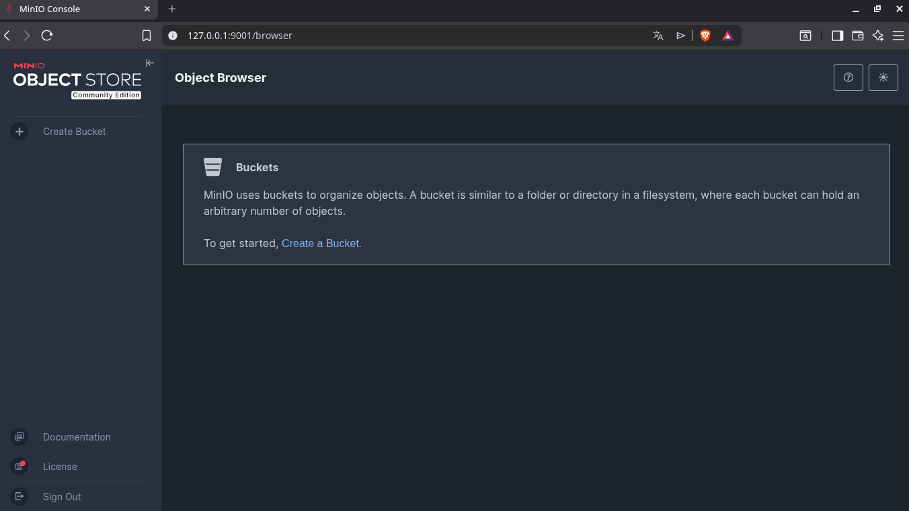
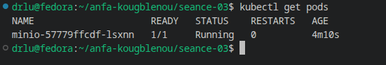
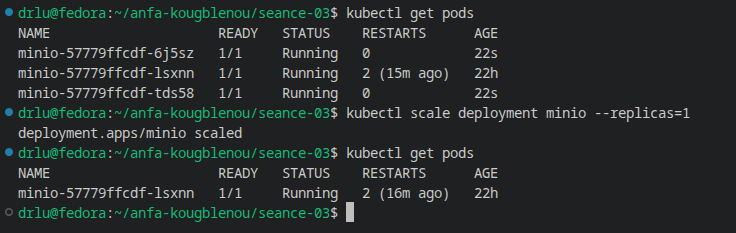

# Rendu  Séance 3

**Nom et prénom :** Amos Kokou KOUGBLENOU
**Identifiant GitHub :** akinnoamakawg
**Date de soumission :** 26/06/2026

## Resume de la seance

## Etapes principales

1. Installation de Kind et kubectl, création du cluster `anfa`.
2. Création du namespace `anfa` et configuration de kubectl.
3. Déploiement de MinIO via 3 manifestes YAML (PVC, Deployment, Service).
4. Observation du self-healing après suppression manuelle d'un pod.
5. Scaling du Deployment de 1 à 3 replicas, puis retour à 1.
6. Activation de l'Ingress Controller nginx.

## Captures d'ecran

### Console MinIO accessible via port-forward


### Self-healing observé


### Scaling à 3 replicas


## Réponses aux exercices d'application

### Exercice 1 : QCM

1.1 B
K8s orchestre des conteneurs sur un cluster en s'appuyant sur un container runtime (containerd, CRI-O...) ; il ne remplace pas Docker, il l'utilise/le complète.

1.2 B
etcd est la base de données clé-valeur qui stocke l'état complet du cluster (source de vérité).

1.3 C
Le Scheduler choisit le nœud le plus adapté pour un nouveau pod (ressources dispo, contraintes...).

1.4 C
L'API Server est le point d'entrée unique : kubectl lui envoie toutes les requêtes (lecture/écriture), il consulte etcd derrière.

1.5 B
Le Deployment (via son ReplicaSet) surveille l'état désiré et recrée immédiatement un pod de remplacement.

1.6 B
NodePort ouvre un port fixe sur chaque nœud, accessible sans load balancer cloud (contrairement à LoadBalancer qui en demande un, ou Ingress qui en a généralement besoin en amont).

1.7 B
scale --replicas=5 modifie l'état désiré ; Kubernetes converge ensuite vers 5 pods (création ou suppression selon le nombre actuel).

1.8 B
Un Namespace isole logiquement des ressources (équipe, environnement, application), ce n'est pas un mécanisme de sécurité réseau ou de chiffrement en soi.

1.9 B
Avec Kind (Kubernetes IN Docker), chaque "nœud" du cluster est en réalité un conteneur Docker tournant sur ta machine hôte.

### Exercice 2 : Lecture d'un manifeste

2.1 – selector.matchLabels vs template.metadata.labels
selector.matchLabels indique au Deployment quels pods il doit considérer comme les siens (pour les compter, les mettre à jour, les remplacer). Il doit obligatoirement correspondre aux labels définis dans template.metadata.labels, car c'est ce label que les pods créés porteront réellement. Sans cette correspondance, le Deployment ne "reconnaîtrait" pas ses propres pods.

2.2 – Nombre de pods et résilience
replicas: 2 → 2 pods seront créés. Si l'un des deux meurt, le ReplicaSet associé au Deployment détecte l'écart entre l'état désiré (2) et l'état observé (1), et recrée automatiquement un nouveau pod pour revenir à 2.

2.3 – Pourquoi minio et pas une IP
minio est probablement le nom d'un Service Kubernetes. Le cluster dispose d'un DNS interne (CoreDNS) qui résout automatiquement le nom d'un Service vers son adresse (ClusterIP). Cela fonctionne car Kubernetes fait du service discovery : peu importe sur quel pod/IP tourne réellement MinIO (les IP de pods changent), le nom du Service reste stable et résolvable dans tout le cluster.

2.4 – Absence de Service : conséquence
Sans Service, l'API n'a aucun point d'accès stable :
    -Pas de nom DNS interne (anfa-api) pour la joindre depuis d'autres pods.
    -Pas de répartition de charge entre les 2 replicas.
    -Les IP des pods changent à chaque redémarrage, donc rien de fiable à appeler.

2.5 – Manifeste de Service (ClusterIP, port 80 → 8000)

```yaml
    apiVersion: v1
    kind: Service
    metadata:
        name: anfa-api
        namespace: anfa
    spec:
        type: ClusterIP
        selector:
            app: anfa-api
        ports:
           - port: 80
             targetPort: 8000

```

### Exercice 3: Diagnostic

3.1 Pod en ImagePullBackOff

    a. Ce statut signifie que Kubernetes a échoué à télécharger (pull) l'image du conteneur, et qu'il réessaie avec un délai croissant (back-off exponentiel) avant de retenter.

    b. Cause très probable : faute de frappe dans le nom de l'image (minio/miniooo:latest au lieu de minio/minio:latest) → l'image n'existe pas sur le registre, le pull échoue (404).

    c. kubectl describe pod minio-7d9f8b6c5-x2k9p (section Events en bas, qui affiche l'erreur exacte du pull).

3.2 PVC en Pending

    a. Pending signifie que le PVC n'a pas encore été lié (bound) à un PersistentVolume : aucun volume ne satisfait sa demande pour le moment.

    b. Sur un cluster Kind local, la cause la plus probable est que la capacité demandée (500 Gi) dépasse l'espace disque réellement disponible sur la machine hôte qui sert de "nœud" — le provisionneur de stockage local (local-path-provisioner, StorageClass standard) ne peut pas créer un volume aussi grand.

    c. kubectl describe pvc data-pvc pour voir les Events (message d'échec de provisioning) — et éventuellement kubectl get storageclass pour vérifier la StorageClass disponible.

3.3 Port-forward qui échoue

    a. L'erreur apparaît car kubectl port-forward a besoin d'un pod en cours d'exécution (Running) pour établir le tunnel ; ici le pod est encore en Pending, donc il n'y a rien à forwarder.

    b. kubectl describe pod <nom-du-pod> pour voir pourquoi il reste en Pending (souvent : problème de scheduling, image, ou PVC non lié — cf. 3.2).

    c. Ordre logique :

   1. Appliquer les manifestes (kubectl apply -f ...)
   2. Vérifier que le pod est Running/Ready (kubectl get pods)
   3. Vérifier que le Service cible bien le pod (endpoints)
   4. Lancer le port-forward seulement une fois ces étapes validées


### Exercice 4: De Docker compose a Kubernetes

4.1 – Manifestes nécessaires
Pour reproduire ce seul service Compose, il faut généralement :

1. Deployment — fait tourner le conteneur MinIO (image, commande, variables d'env).
2. PersistentVolumeClaim — remplace volumes: minio-data:/data pour la persistance.
3. Service (ClusterIP) — pour que les autres pods (ex: anfa-api) joignent MinIO via un nom stable.
4. Service (NodePort/LoadBalancer) ou usage de port-forward — pour accéder à la console web (port 9001) depuis l'extérieur.
5. (Optionnel mais recommandé) Secret — pour stocker MINIO_ROOT_USER / MINIO_ROOT_PASSWORD au lieu de les mettre en clair dans le manifeste.

4.2 – Volume Docker nommé vs PVC
Un volume Docker nommé est une simple zone de stockage gérée directement par le moteur Docker sur une seule machine : pas d'abstraction, pas de notion de taille/quota. Un PVC Kubernetes est une demande déclarative de stockage (taille, mode d'accès) qui est ensuite liée dynamiquement à un PersistentVolume réel (disque cloud, stockage local, NFS...) via une StorageClass — ce qui rend le stockage portable et indépendant du nœud physique, contrairement au volume Docker qui reste lié à l'hôte.

4.3 – Pourquoi le port-forward est nécessaire avec Kind
En Compose, ports: "9001:9001" mappe directement le port sur la machine hôte car Docker tourne en natif sur cette machine. Avec Kind, chaque "nœud" Kubernetes est lui-même un conteneur Docker : un NodePort ouvre un port sur ce nœud-conteneur, pas directement sur ta machine. Sans configuration supplémentaire, ce port n'est pas exposé sur localhost, d'où le besoin de kubectl port-forward pour créer ce tunnel.
Pour un accès direct comme avec Compose, il faudrait configurer le cluster Kind avec des extraPortMappings dans son fichier de config (kind-config.yaml), qui mappent un port du nœud-conteneur vers un port de la machine hôte au moment de la création du cluster.

4.4 – Deux apports concrets de Kubernetes observés

- Auto-réparation (self-healing) : si le pod MinIO crashe, Kubernetes le recrée automatiquement pour respecter l'état désiré — pas besoin de relancer manuellement comme on pourrait devoir le faire avec Compose.
- Scaling déclaratif simple : kubectl scale --replicas=N permet d'ajuster facilement le nombre d'instances, alors que Compose reste pensé pour un seul hôte sans réelle logique d'orchestration multi-machines.


### Exercice 5: Mini-cas d'architecture (Anfa)

5.1 – Type d'objet par composant

| Composant | Type recommandé | Justification |
|---|---|---|
| pipeline-anfa | CronJob | Tâche planifiée (2h du matin), ponctuelle (~15 min) puis se termine — exactement le rôle d'un CronJob (qui crée des Jobs selon un calendrier). |
| anfa-api | Deployment | Service stateless qui doit tourner en continu, être scalable et toujours disponible — cas d'usage typique du Deployment (+ HPA). |
| anfa-dashboard | Deployment | Application web qui doit rester disponible en journée, sans état persistant propre à géré au niveau K8s — un Deployment simple (1-2 replicas) suffit. |

5.2 – Paramètres HPA pour anfa-api

- minReplicas: 2 — garder une redondance minimale même en heures creuses (évite un point unique de défaillance, cohérent avec "toujours disponible").
- maxReplicas: 8 (ou 10) — dimensionné pour absorber les pics à ~50 req/s avec une marge de sécurité.
- Métrique cible : utilisation CPU ~65-70% (ou une métrique custom du type requêtes/seconde par pod, si disponible).

Justification : la charge varie d'un facteur ~10 entre les heures creuses (5 req/s) et les pics (50 req/s, matin/soir). L'HPA permet de réduire les coûts en heures creuses (peu de replicas) tout en absorbant automatiquement les pics sans intervention manuelle, ce qui correspond directement au profil de trafic décrit.

5.3 – Type de Service pour anfa-api
LoadBalancer. L'API doit être joignable depuis l'extérieur (applications mobiles des conducteurs), et le cluster tourne chez un fournisseur cloud managé — celui-ci peut provisionner automatiquement un vrai load balancer externe avec IP publique stable, ce qui n'était pas possible avec Kind en local. (En pratique on coupler souvent un Ingress derrière ce LoadBalancer pour gérer le routage/TLS si plusieurs services existent, mais parmi les 3 choix proposés, LoadBalancer est le plus adapté.)

5.4 – Mise à jour sans coupure (Rolling Update)
Par défaut, un Deployment Kubernetes utilise la stratégie RollingUpdate : il crée progressivement de nouveaux pods avec la nouvelle version de l'image, attend qu'ils soient Ready (probes de disponibilité validées), puis ne supprime les anciens pods qu'au fur et à mesure, par petits lots (contrôlés par maxSurge et maxUnavailable, 25% par défaut). Ainsi, il y a toujours un nombre suffisant de pods opérationnels pour servir le trafic pendant toute la durée du déploiement, contrairement à une stratégie Recreate qui stopperait tous les anciens pods avant d'en créer de nouveaux (coupure totale).

5.5 – Squelette de Deployment pour anfa-api

```yaml
    apiVersion: apps/v1
    kind: Deployment
    metadata:
        name: anfa-api
        namespace: anfa
    spec:
        replicas: 3
        selector:
            matchLabels:
                app: anfa-api
        template:
            metadata:
                labels:
                    app: anfa-api
            spec:
                containers:
                    - name: api
                    image: anfa/api:v1
                    ports:
                        - containerPort: 8000
                    env:
                        - name: MINIO_ENDPOINT
                        value: "http://minio:9000"
```

## Difficultés rencontrées