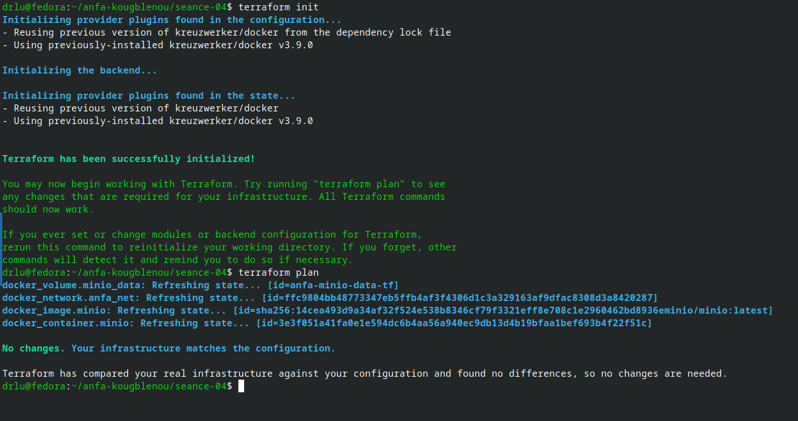
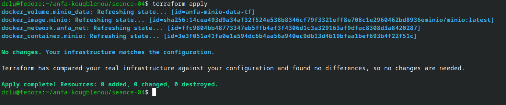
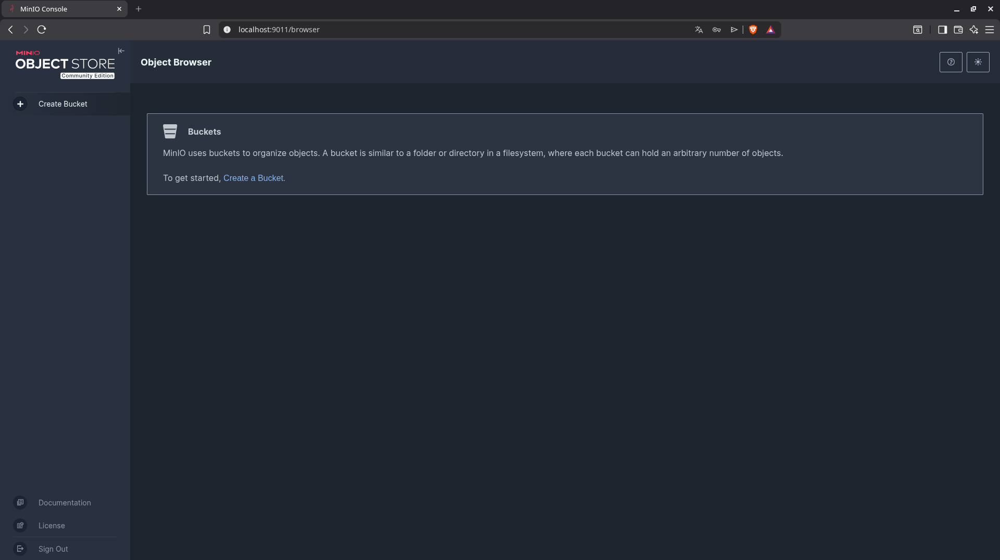
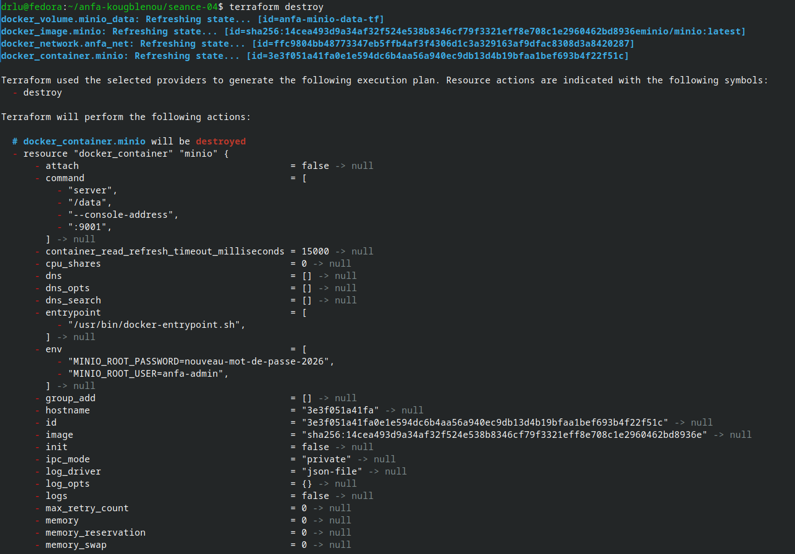
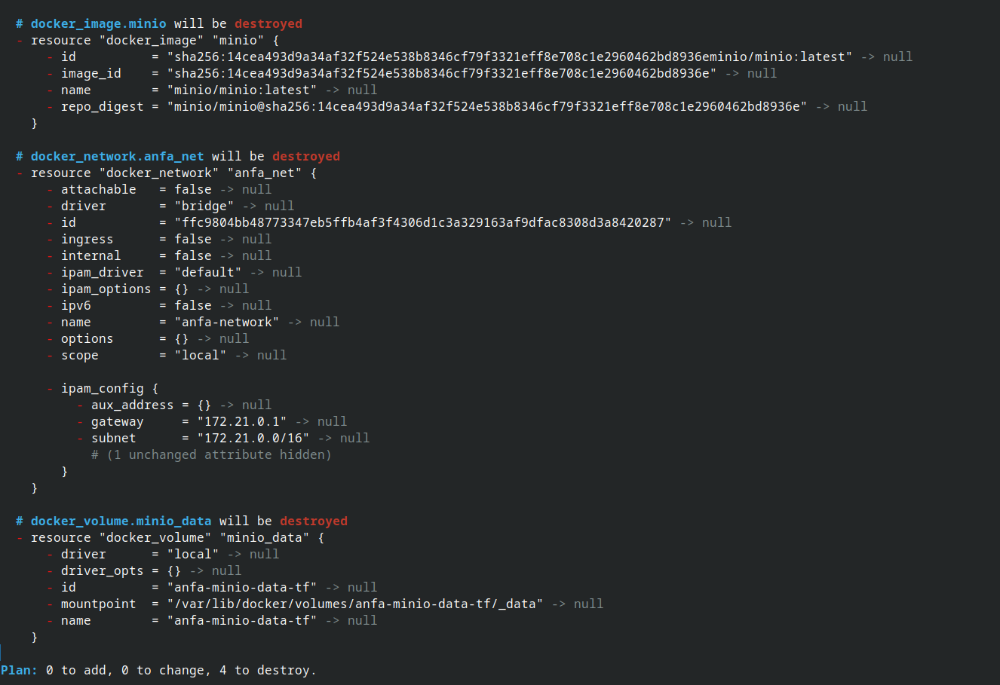
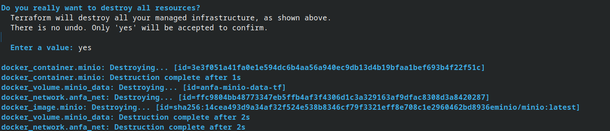

# rendu - Séance 4

**Nom et prénom :** Amos Kokou KOUGBLENOU
**identifiant GitHub :** akinnoamakawg
**Date de soumission :** 27/06/2026

## Resume de la seance
## Etapes principales

1. Installation de Terraform et premier `main.tf` minimal.
2. Maîtrise du workflow `init` → `plan` → `apply` → `destroy`.
3. Compréhension du state Terraform et bonnes pratiques de versioning.
4. Stack complète : réseau, volume, conteneur MinIO.
5. Refactoring en variables et fichier `.tfvars`.

## Captures d'ecran

### terraform plan (creation initiale)


### terraform aplly reussi


### Console MinIO creer par Terraform


### terraform destroy




# Reponses aux questions d'application

## Exercice 1 — QCM conceptuel

**1.1** Réponse : **B**
Fausse, car l'IaC ne dispense jamais de comprendre l'infrastructure sous-jacente : il faut toujours savoir ce que fait réellement le code (réseaux, sécurité, dépendances) pour l'écrire et le déboguer correctement.

**1.2** Réponse : **B**
Le déclaratif décrit l'état final souhaité et laisse l'outil déterminer comment l'atteindre, tandis que l'impératif liste les étapes précises à exécuter dans l'ordre.

**1.3** Réponse : **B**
Idempotent signifie qu'appliquer l'opération une fois ou N fois produit exactement le même résultat final, sans effet cumulatif.

**1.4** Réponse : **B**
Un provider est un plugin qui traduit le code Terraform en appels à l'API d'un service précis (AWS, Docker, Kubernetes, etc.).

**1.5** Réponse : **B**
Terraform compare le state (ce qu'il a créé) au code (ce qui est désiré) ; si aucun écart n'est détecté, il n'effectue aucune action.

**1.6** Réponse : **C**
Le fichier `terraform.tfstate` mémorise l'état réel des ressources créées, ce qui permet à Terraform de calculer les changements incrémentaux lors d'un prochain `plan`/`apply`.

**1.7** Réponse : **B**
Le state peut contenir des secrets en clair (mots de passe, clés API) et des commits concurrents sur ce fichier peuvent le corrompre ou créer des conflits de fusion dangereux.

**1.8** Réponse : **C**
`terraform plan` calcule et affiche les changements prévus sans les appliquer, avant un `terraform apply`.

**1.9** Réponse : **B**
OpenTofu est un fork open source de Terraform, créé par la communauté après le changement de licence de HashiCorp (passage à la BSL) en 2023.

**1.10** Réponse : **B**
Terraform et Ansible sont complémentaires : Terraform provisionne (crée) l'infrastructure, Ansible configure des machines déjà existantes (installation de paquets, configuration de services, etc.).

---

## Exercice 2 — Lecture et interprétation d'un fichier Terraform

### 2.1 — Les 4 resources

| Resource | Rôle |
|---|---|
| `docker_network.back` | Crée un réseau Docker nommé `anfa-backend` permettant aux conteneurs de communiquer entre eux. |
| `docker_volume.data` | Crée un volume Docker nommé `postgres-data` pour stocker les données PostgreSQL de manière persistante (survit à la suppression du conteneur). |
| `docker_image.postgres` | Télécharge (pull) l'image Docker `postgres:15` qui servira de base au conteneur. |
| `docker_container.db` | Crée et démarre le conteneur PostgreSQL `anfa-postgres`, en utilisant l'image, le volume et le réseau définis ci-dessus, avec ses variables d'environnement et son mapping de port. |

### 2.2 — La référence `docker_image.postgres.image_id`

C'est l'**ID de l'image** réellement téléchargée par la resource `docker_image.postgres` (un hash, pas juste le nom du tag).

Par rapport à écrire `image = "postgres:15"` en dur, cette référence :
- crée une **dépendance explicite** dans le graphe Terraform : le conteneur ne peut être créé qu'après l'image, et Terraform le sait automatiquement ;
- garantit que si l'image change (nouveau pull, nouvelle version sous le même tag), Terraform **détecte le changement d'ID** et peut recréer le conteneur en conséquence, alors qu'une simple chaîne `"postgres:15"` ne changerait jamais aux yeux de Terraform.

### 2.3 — Ordre de création

Ordre : **`docker_network.back`, `docker_volume.data` et `docker_image.postgres` en premier (en parallèle, sans ordre imposé entre elles), puis `docker_container.db` en dernier.**

Pourquoi : Terraform construit un graphe de dépendances à partir des références dans le code. Le réseau, le volume et l'image n'ont aucune référence entre eux, donc rien ne les ordonne l'un par rapport à l'autre (Terraform peut même les créer en parallèle). En revanche, `docker_container.db` référence les trois (`image_id`, `volume_name`, `network.back.name`), donc il doit obligatoirement attendre qu'elles existent.

### 2.4 — Problème de sécurité et correction

**Problème** : le mot de passe `POSTGRES_PASSWORD=secret123` est écrit **en clair** dans le fichier `main.tf`, qui est versionné dans Git — donc visible par toute personne ayant accès au dépôt (et potentiellement dans l'historique Git pour toujours).

**Correction concrète** : utiliser une variable Terraform marquée `sensitive`, alimentée à l'exécution (variable d'environnement ou fichier `.tfvars` non commité) plutôt qu'écrite en dur.

```hcl
variable "postgres_password" {
  type      = string
  sensitive = true
}

resource "docker_container" "db" {
  # ...
  env = [
    "POSTGRES_DB=anfa",
    "POSTGRES_USER=anfa_user",
    "POSTGRES_PASSWORD=${var.postgres_password}",
  ]
  # ...
}
```

La valeur serait alors fournie via `TF_VAR_postgres_password` (variable d'environnement) ou un fichier `secrets.auto.tfvars` ajouté au `.gitignore`.

### 2.5 — Destroy puis modification puis apply

Avec `terraform destroy`, **toute l'infrastructure est détruite** (network, volume, image, conteneur) et le state devient vide (plus aucune ressource suivie).

L'étudiant modifie ensuite `external = 5432` en `external = 5433` dans le code.

Au `terraform apply` suivant : comme le state est vide, Terraform ne voit **aucune ressource existante** à comparer — il va donc **tout recréer entièrement** (network, volume, image, conteneur), cette fois avec le port externe `5433`. Ce n'est **pas** une mise à jour incrémentale du port sur une infrastructure existante : c'est une création complète depuis zéro, car `destroy` a vidé le state.

---

## Exercice 3 — Diagnostic

### 3.1 — Dépendance circulaire

**a.** Cette erreur signifie que Terraform a détecté un **cycle** dans le graphe de dépendances : `docker_container.a` dépend de `docker_container.b` (via `${docker_container.b.name}`), et `docker_container.b` dépend en retour de `docker_container.a`. Aucun des deux ne peut donc être créé avant l'autre.

**b.** Terraform construit un **graphe orienté acyclique (DAG)** pour décider dans quel ordre créer les ressources. Si A dépend de B et B dépend de A, il est impossible de déterminer qui créer en premier — Terraform refuse d'appliquer un graphe qui n'est pas un DAG, car il ne peut pas résoudre un ordre d'exécution valide.

**c.** Solution : casser le cycle en supprimant la dépendance mutuelle au moment de la création. Par exemple :
- fixer des noms de conteneurs **statiques** (en dur) plutôt que de les référencer dynamiquement entre eux (`container-a` et `container-b` connus à l'avance, sans passer par `docker_container.b.name`) ;
- ou laisser les conteneurs se découvrir au **runtime** via le DNS interne du réseau Docker (chaque conteneur joint le même réseau et utilise le nom du service comme hostname), au lieu de résoudre cette référence à la création via Terraform.

### 3.2 — Plan qui veut tout recréer

**a.** Terraform marque `-/+` (destruction + recréation) plutôt que `~` (modification en place) parce que l'attribut modifié (`env`, les variables d'environnement du conteneur) est un attribut qui, pour le provider Docker, **ne peut pas être mis à jour sur un conteneur en cours d'exécution** (attribut "ForceNew"). Les variables d'environnement sont injectées une seule fois au démarrage du conteneur ; pour en changer, il faut recréer le conteneur entièrement.

**b.** Non, les données **ne seront pas perdues**, à condition que le volume soit bien une resource Docker séparée (`docker_volume`) référencée par `volume_name`, comme c'est le cas ici. Seul le **conteneur** (le processus et son filesystem éphémère) est détruit puis recréé ; le volume, lui, n'est pas concerné par ce plan et persiste indépendamment. Les données survivent donc à la recréation.

**c.** Non, ce n'est pas "gratuit" en production. Impacts opérationnels possibles :
- **interruption de service (downtime)** pendant la fenêtre où l'ancien conteneur est arrêté et le nouveau démarre ;
- perte des connexions réseau actives vers ce conteneur ;
- changement potentiel d'adresse IP interne du conteneur, ce qui peut casser des configurations qui en dépendent ;
- nécessité de planifier une fenêtre de maintenance, ou de mettre en place un mécanisme de mise à jour sans coupure (rolling update derrière un load balancer) pour éviter l'impact.

### 3.3 — State corrompu

**a.** Risque de sécurité immédiat : le fichier state contient potentiellement des **secrets en clair** (mots de passe, clés API, identifiants des ressources réelles) qui se retrouvent exposés publiquement sur GitHub — n'importe qui peut les récupérer et compromettre l'infrastructure.

**b.** Risque technique pour Awa : le state récupéré peut être **désynchronisé** par rapport à la réalité de sa propre machine (les ressources Docker du collègue n'existent pas forcément chez elle, ou existent avec des IDs différents). En lançant `terraform apply`, Terraform pourrait tenter de modifier ou détruire des ressources qui n'existent pas localement, créer des doublons (conflits de noms/ports), ou échouer avec des erreurs incohérentes — voire, dans un contexte cloud réel, agir sur l'infrastructure de quelqu'un d'autre si le state pointe vers des ressources partagées.

**c.** Solution pérenne : utiliser un **backend distant partagé** pour stocker le state (par ex. un stockage objet avec mécanisme de verrouillage/lock), jamais un state local versionné dans Git. Concrètement : ajouter `terraform.tfstate` et `terraform.tfstate.backup` au `.gitignore`, et configurer un backend remote (`backend "s3"`, ou équivalent OVHcloud Object Storage) avec locking pour que toute l'équipe travaille sur un état unique et synchronisé.

---

## Exercice 4 — Adaptation Compose → Terraform

```hcl
terraform {
  required_providers {
    docker = {
      source  = "kreuzwerker/docker"
      version = "~> 3.0"
    }
  }
}

provider "docker" {}

# --- Variables ---

variable "minio_root_user" {
  type    = string
  default = "anfa-admin"
}

variable "minio_root_password" {
  type      = string
  sensitive = true
}

# --- Réseau partagé (équivalent du réseau implicite Compose) ---

resource "docker_network" "anfa_net" {
  name = "anfa-network"
}

# --- Volume MinIO ---

resource "docker_volume" "minio_data" {
  name = "minio-data"
}

# --- Service MinIO ---

resource "docker_image" "minio" {
  name = "minio/minio:latest"
}

resource "docker_container" "minio" {
  name  = "anfa-minio"
  image = docker_image.minio.image_id

  env = [
    "MINIO_ROOT_USER=${var.minio_root_user}",
    "MINIO_ROOT_PASSWORD=${var.minio_root_password}",
  ]

  ports {
    internal = 9000
    external = 9000
  }
  ports {
    internal = 9001
    external = 9001
  }

  volumes {
    volume_name    = docker_volume.minio_data.name
    container_path = "/data"
  }

  networks_advanced {
    name = docker_network.anfa_net.name
  }

  command = ["server", "/data", "--console-address", ":9001"]
}

# --- Service Jupyter ---

resource "docker_image" "jupyter" {
  name = "jupyter/scipy-notebook:latest"
}

resource "docker_container" "jupyter" {
  name  = "anfa-jupyter"
  image = docker_image.jupyter.image_id

  env = [
    "JUPYTER_TOKEN=anfa-token",
  ]

  ports {
    internal = 8888
    external = 8888
  }

  networks_advanced {
    name = docker_network.anfa_net.name
  }
}
```

**Remarques :**
- Le réseau `docker_network.anfa_net` remplace le réseau implicite que Compose crée automatiquement.
- Le mot de passe MinIO passe par `var.minio_root_password` (marquée `sensitive`), à fournir via `TF_VAR_minio_root_password` ou un fichier `.tfvars` non versionné — jamais en clair.
- Comme `docker_container.jupyter` ne référence pas directement MinIO mais référence le même réseau que lui, Terraform ne garantit pas un ordre strict MinIO-avant-Jupyter à moins d'ajouter une dépendance explicite (`depends_on`) si l'ordre de démarrage applicatif importe réellement — contrairement à `depends_on` dans Compose, ici ce n'est pas automatique sauf référence directe entre les deux conteneurs.

---

## Exercice 5 — Mini-cas d'architecture

### 5.1 — Types de resources Terraform envisagées

1. Un **bucket de stockage objet** (pour les CSV du référentiel et les futurs logs GPS, hébergés chez OVHcloud pour la souveraineté des données).
2. Un **cluster Kubernetes managé** (ou un groupe de machines avec autoscaling) pour héberger les traitements Spark et bénéficier de l'élasticité aux heures de pointe.
3. Un **réseau privé virtuel (VPC) et des règles de pare-feu/sécurité** pour isoler les ressources internes.
4. Une **passerelle publique / load balancer** pour exposer le dashboard Grafana de façon sécurisée sur Internet.
5. *(optionnel)* Une **base de données managée** si les métadonnées ou résultats de traitement doivent être stockés de façon structurée.

### 5.2 — Un seul fichier vs plusieurs fichiers

Je recommande l'**option B** (fichiers séparés : `network.tf`, `storage.tf`, `compute.tf`, `monitoring.tf`).

Justification : Terraform traite tous les fichiers `.tf` d'un même répertoire comme un seul module, donc cela ne change rien fonctionnellement — mais sur le plan humain, séparer le code par domaine rend le projet bien plus lisible, facilite la revue de code (on sait où chercher), et réduit les conflits Git lorsque plusieurs personnes travaillent en parallèle sur des parties différentes de l'infrastructure. Un fichier unique de 800 lignes devient vite ingérable à 4 personnes.

### 5.3 — Gérer dev et prod avec la même définition

Deux mécanismes Terraform :
1. **Des fichiers de variables (`.tfvars`) par environnement** : un même code avec `variables.tf`, et des valeurs différentes dans `dev.tfvars` / `prod.tfvars` (taille de cluster, noms de buckets, etc.), appliquées via `terraform apply -var-file="dev.tfvars"`.
2. **Les workspaces Terraform** (`terraform workspace new dev`, `terraform workspace new prod`) qui permettent de maintenir un **state séparé** par environnement tout en réutilisant le même code, en combinant souvent avec `terraform.workspace` dans le code pour adapter certains noms ou tailles dynamiquement.

### 5.4 — Migration OVH → AWS

Ce ne serait **pas trivial**, et demanderait un **effort important**, même si Terraform aide à structurer le travail.

Ce qui se transpose facilement : la **logique globale** (structure du projet, découpage en modules, variables, outputs, workflow `plan`/`apply`, gestion d'état et de versions) reste la même, car c'est indépendant du provider.

Ce qui demande du travail : chaque **resource est spécifique au provider** — un bucket OVHcloud Object Storage n'est pas un bucket AWS S3, un cluster Kubernetes managé OVH n'est pas un EKS, et les modèles d'IAM, de réseau (VPC, security groups) et d'authentification diffèrent fortement entre fournisseurs. Il faut donc **réécrire presque tous les blocs `resource`** un par un avec le nouveau provider, pas juste changer un nom de provider — l'effort est de l'ordre de plusieurs jours à plusieurs semaines selon la taille de l'infrastructure, pas une bascule immédiate.

### 5.5 — Bonnes pratiques pour une équipe de 4 personnes

1. **Backend distant avec verrouillage (locking)** pour le state : éviter les states locaux versionnés dans Git, qui causent corruptions et conflits (cf. exercice 3.3).
2. **Revue de code systématique (Pull Request + `terraform plan` joint)** avant tout `apply`, pour que chaque changement d'infrastructure soit relu et discuté par au moins une autre personne de l'équipe avant d'être appliqué.
3. **Gestion centralisée des secrets** (variables marquées `sensitive`, fichiers `.tfvars` non commités ou gestionnaire de secrets dédié) combinée à une séparation claire des environnements (dev/prod), pour éviter les fuites de mots de passe en clair dans le code partagé.
