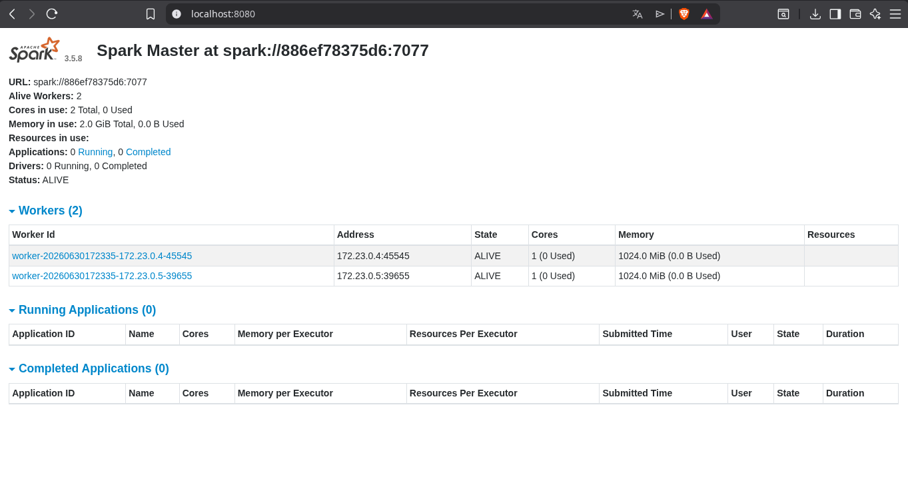
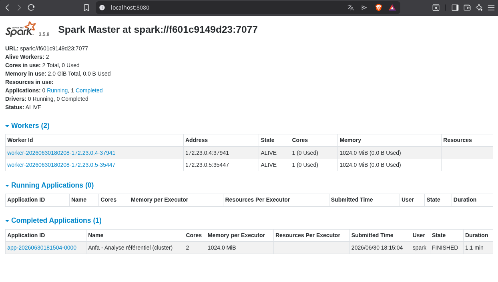
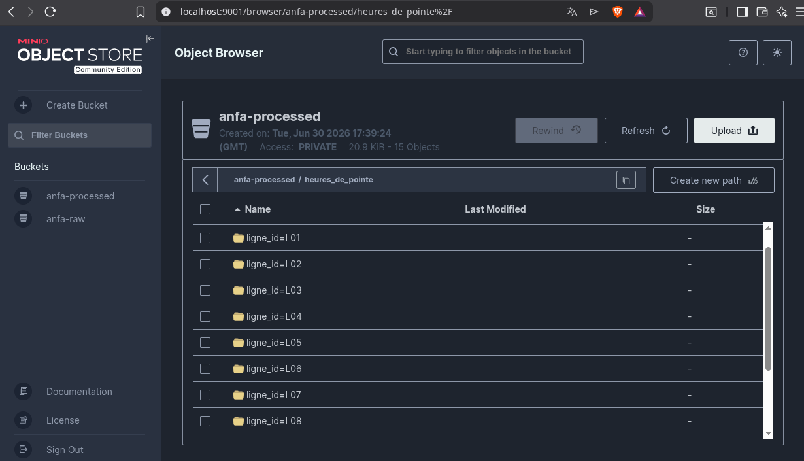
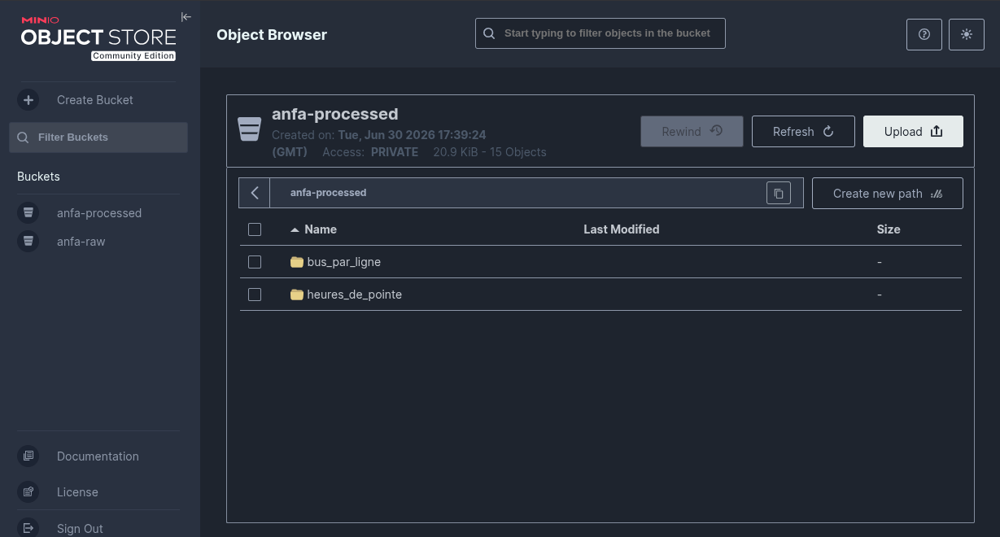

# Rendu Séance 5

**Nom et prénom :** Amos Kokou KOUGBLENOU

## Résumé de la séance

## Etapes principales

## Captures d'écran

### Dasboard Spark Master avec 2 workers

### Application Spark exécutée avec succès

### Résultats du Top 10 dans la console

### Bucket anfa-processed avec heures_de_pointe partitionné

## Réflexion : local vs cluster

## Bonus Spark sur Kubernetes

## Réponses aux exercices d'application

## Difficultés rencontrées
