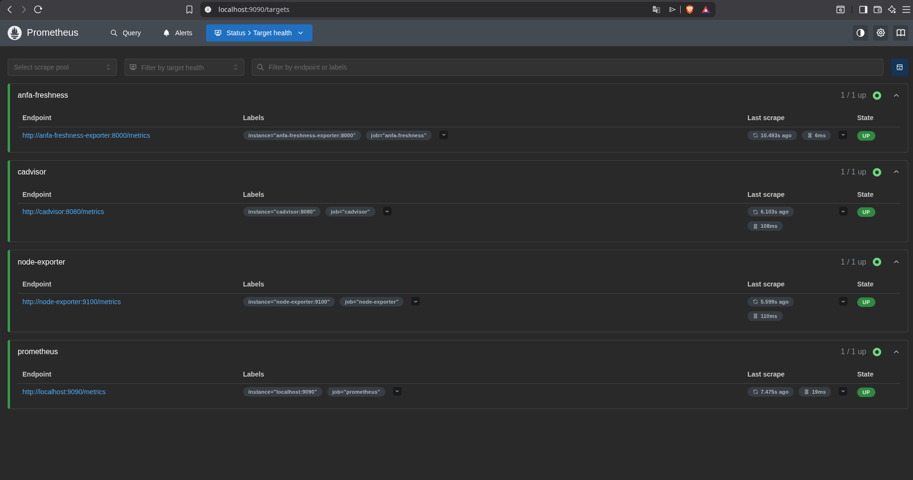
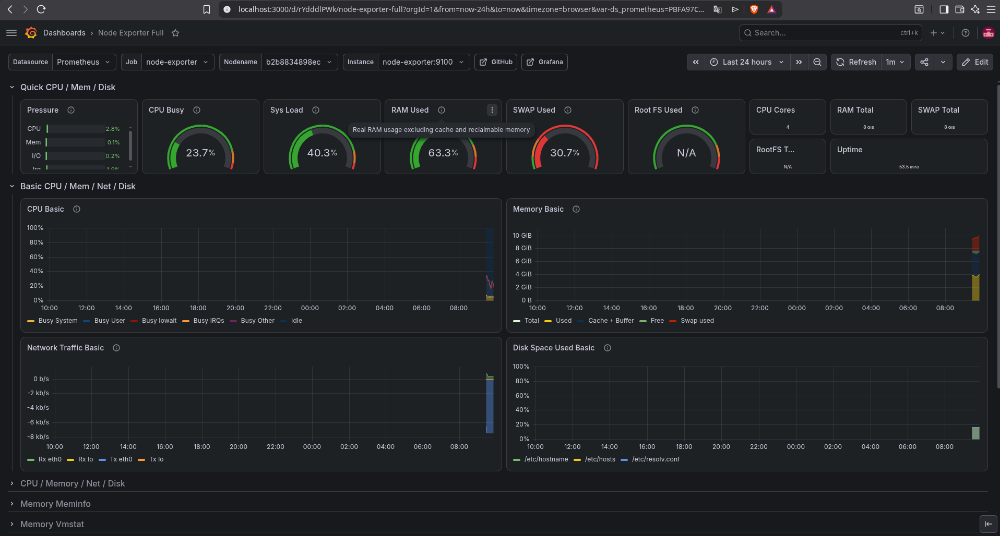
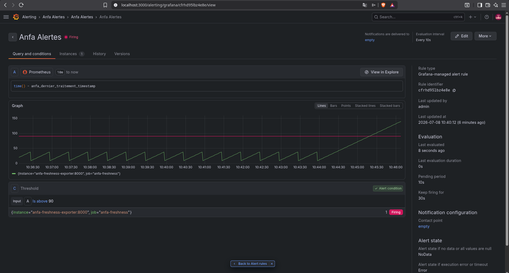

# Rendu — Séance 9

**Nom et prénom :** Amos Kokou KOUGBLENOU
**Identifiant GitHub :** akinnoamakawg
**Date de soumission :** 08/07/2026

## Résumé de la séance

<2-4 lignes : stack Prometheus/Grafana déployée, exportateur de fraîcheur Anfa
instrumenté, dashboard construit, alerte configurée et déclenchée sur panne simulée.>

## Étapes principales

1. Déploiement de Prometheus, Node Exporter, cAdvisor, Grafana et d'un exportateur
   métier custom (fraîcheur des données Anfa).
2. Exploration des cibles Prometheus et premières requêtes PromQL.
3. Import du dashboard "Node Exporter Full" et construction d'un panneau custom.
4. Configuration d'une alerte Grafana sur la fraîcheur des données.
5. Simulation d'une panne silencieuse et observation du déclenchement de l'alerte.

## Captures d'écran

### Les 4 cibles Prometheus à l'état UP

### Dashboard "Node Exporter Full" importé

### Alerte à l'état Firing après panne simulée

## Réflexion personnelle

<3-5 lignes : en quoi cette séance répond-elle directement à la situation-problème
d'Awa dans le CM ? Qu'est-ce que la métrique de fraîcheur vous a permis de voir que
les autres métriques (CPU, RAM, statut des conteneurs) ne montraient pas ?>

- Cette séance répond à la situation-problème d'Awa en lui fournissant une visibilité applicative réelle, là où les infrastructures classiques restent aveugles. Tandis que les métriques de CPU, de RAM et le statut des conteneurs indiquaient que tout était "Up" et fonctionnel en apparence, la métrique de fraîcheur (freshness) a révélé que les données traitées n'étaient plus mises à jour. Elle a permis de détecter un blocage ou un gel fonctionnel de l'application (comme un worker ou un script de traitement bloqué), invisible pour le système d'exploitation mais critique pour le métier.

## Difficultés rencontrées

<Aucune | Décrivez brièvement.>
